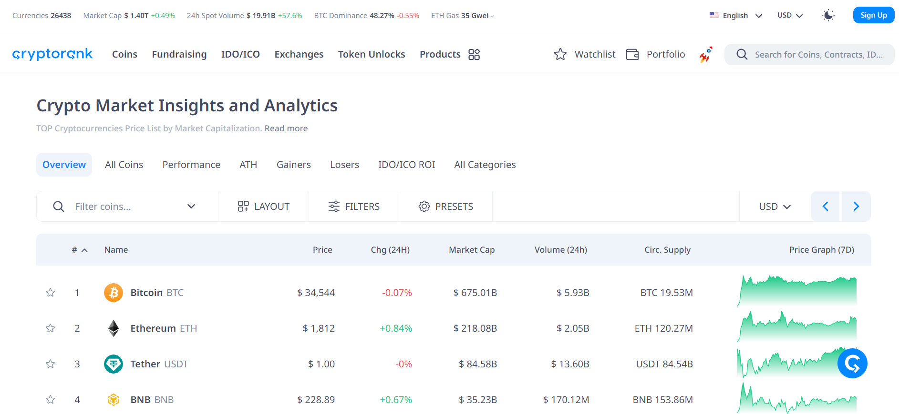
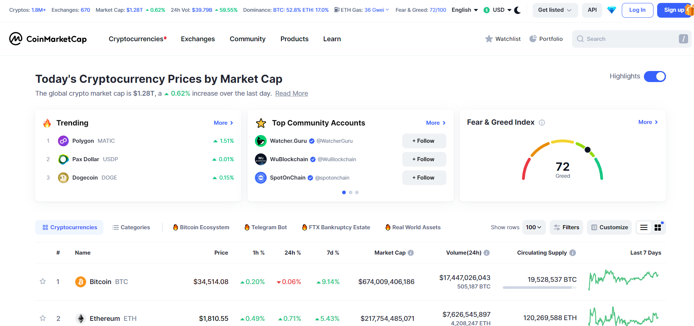
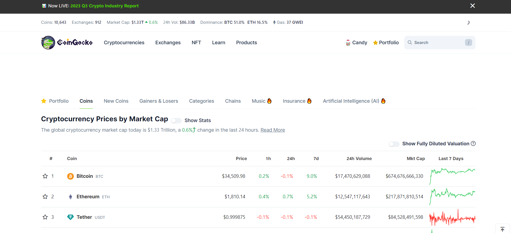
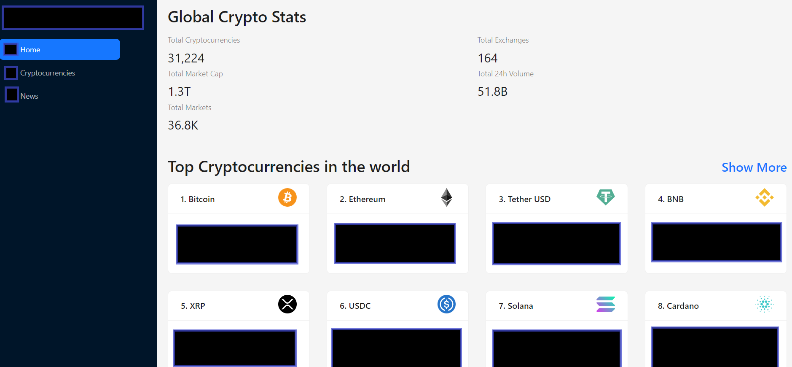
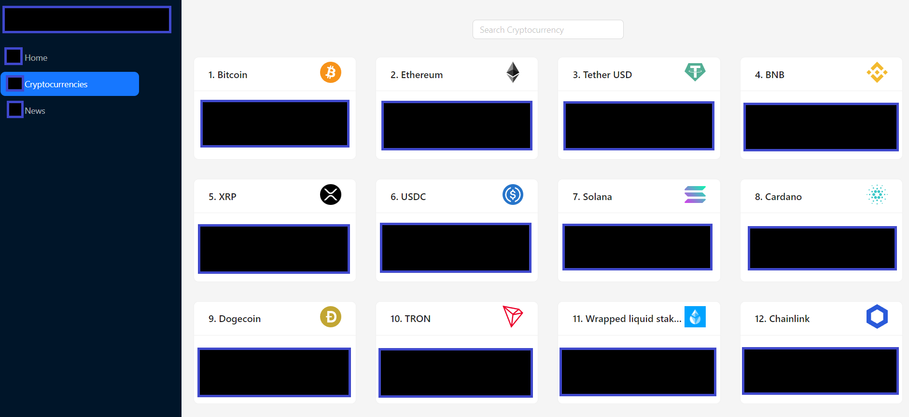
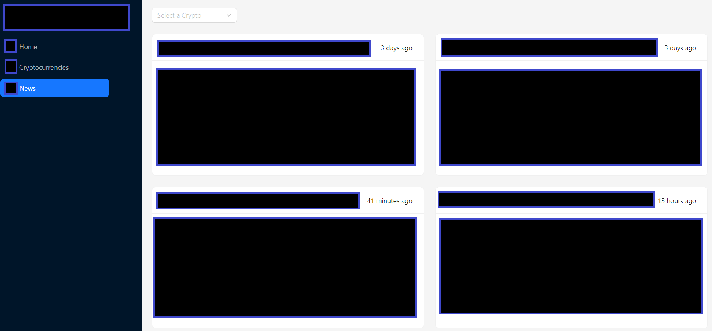
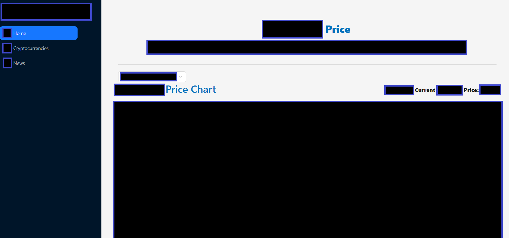

# CryptoZone
---

# Содержание

1. [Введение](#intro)  
   1.1 [Назначение](#appointment)  
   1.2 [Бизнес-требования](#business_requirements)  
   1.2.1 [Исходные данные](#initial_data)  
   1.2.2 [Возможности бизнеса](#business_opportunities)   
   1.3 [Аналоги](#analogues)  
   1.3.1 [CryptoRank](#CryptoRank)  
   1.3.2 [CoinMarketCap](#CoinMarketCap)  
   1.3.3 [CoinGecko](#CoinGecko)
2. [Требования пользователя](#user_requirements)  
   2.1 [Программные интерфейсы](#software_interfaces)  
   2.2 [Интерфейс пользователя](#user_interface)  
   2.3 [Характеристики пользователей](#user_specifications)   
   2.3.1 [Аудитория приложения](#application_audience)  
   2.3.1.1 [Целевая аудитория](#target_audience)  
   2.3.1.2 [Побочная аудитория](#collateral_audience)  
3. [Системные требования](#system_requirements)  
   3.1 [Функциональные требования](#functional_requirements)    
   3.1.1 [Ограничения и исключения](#restrictions_and_exclusions)  
   3.2 [Нефункциональные требования](#non-functional_requirements)  
   3.2.1 [Атрибуты качества](#quality_attributes)  
   3.2.1.1 [Требования к удобству использования](#requirements_for_ease_of_use)    
   3.2.2 [Внешние интерфейсы](#external_interfaces)  
   3.2.3 [Ограничения](#restrictions)

# 1 Введение

## 1.1 Назначение

Веб-приложение "CryptoZone" - это приложение, где вы вы можете узнать последние новости обо всех криптовалютах, 
подробную статистику по более чем 100 из них, тенденции рынка, объем торгов и многое другое.
Веб-приложение создано для пользователей любого браузера.

<a name="business_requirements"/>

## 1.2 Бизнес-требования

<a name="initial_data"/>

### 1.2.1 Исходные данные

Жизнь современного человека стремительно меняется с каждым днём. Сфера криптовалют не является исключением в данном случае.
Криптовалюты становятся достойной заменой фиатным деньгам, многие люди используют их для оплаты различных услуг и товаров.
Курсы некоторых криптовалют не так стабильны и меняются достаточно часто. Людям нужно следить за курсами валют и новостями 
в этой сфере, чтобы сохранить в целости и сохранности свой финансовый портфель. 
Приложение "CryptoZone" позволит удобно отслеживать курсы криптовалют и новости.

<a name="business_opportunities"/>

### 1.2.2 Возможности бизнеса

Это веб-приложение должно пользоваться спросом в современном мире, где финансы и время человека оценивается как никогда дорого. 
Оно призвано сделать жизнь пользователей более безопасной и удобной, и, безусловно, будет пользоваться заслуженной популярностью.

<a name="analogues"/>

## 1.3 Аналоги

<a name="CryptoRank"/>

### 1.3.1 CryptoRank

**Русский интерфейс:** нет  
**Цена:** бесплатный  
**Ссылка на сайт производителя:** https://cryptorank.io/

Окно CryptoRank.  
  

CryptoRank.io - это сайт, который предоставляет рыночную аналитику, цены, объемы и рейтинги различных криптовалют 
по их рыночной капитализации и объему торгов. Вы также можете найти информацию о последних финансированиях, 
предстоящих и завершенных токенсейлах, трендовых монетах и новостях из криптоиндустрии.

<a name="CoinMarketCap"/>

## 1.3.2 CoinMarketCap

**Русский интерфейс:** нет  
**Цена:** бесплатный  
**Ссылка на сайт производителя:** https://coinmarketcap.com/

Окно CoinMarketCap.  

CoinMarketCap.com - это один из самых популярных сайтов для отслеживания цен и данных по криптовалютам.
Вы можете просматривать рейтинги, графики, объемы и другие метрики по более чем 10 тысячам криптовалют. 

<a name="CoinGecko"/>

## 1.3.3 CoinGecko

**Русский интерфейс:** нет 
**Цена:** бесплатный
**Ссылка на сайт производителя:** https://www.coingecko.com/

Окно CoinGecko.  

CoinGecko.com - это еще один популярный сайт для отслеживания цен и данных по криптовалютам. 
Вы можете просматривать полный список активных криптовалют, сортировать их по различным параметрам, 
таким как рыночная капитализация, 24-часовой объем, цена, оборотный запас и т.д.. 
Вы также можете отслеживать метрики, такие как 24-часовое изменение, историческая производительность, 
циркулирующее предложение и т.д.

<a name="user_requirements"/>

# 2 Требования пользователя

<a name="software_interfaces"/>

## 2.1 Программные интерфейсы

Составляющие проекта:
Клиентская часть реализована на фреймворке React с использованием TypeScript и библиотеки Redux Toolkit.
Данные берутся со сторонних источников с помощью запросов к API различных веб-сервисов с открытым доступом на Rapid API.

<a name="user_interface"/>

## 2.2 Интерфейс пользователя
 
 Так как приложение является SPA, то в каждом окне присутствуют как одинаковые кнопки, так и отличающиеся от остальных.
 В описании Главного окна будет изложена реакция приложения на нажатие основных кнопкок "Home", "CryptoZone", "Cryptocurrencies", "News".
 
 Главное окно веб-приложения. 
 
При нажатии на кнопку "Home" - веб-приложение переходит в начальное окно приложения.  
При нажатии на кнопку "CryptoZone" - веб-приложение переходит в начальное окно приложения.
При нажатии на кнопку "Cryptocurrencies" - веб-приложение переходит в окно со списком криптовалют, которое содержит окно поиска.  
При нажатии на кнопку "News" - веб-приложение переходит в окно с новостями о криптовалютах, можно выбрать конкретную криптовалюту, 
новости о которой пользователь захочет увидеть. 
При нажатии на кнопку "Show more" в подразделе 'Top Cryptocurrencies in the world' - веб-приложение переходит в окно со списком 
криптовалют, которое содержит окно поиска
При нажатии на кнопку "Show more" в подразделе 'Latest Crypto News'  - веб-приложение переходит в окно с новостями о криптовалютах, 
можно выбрать конкретную криптовалюту, новости о которой пользователь захочет увидеть. 
Окно со списком криптовалют.  
  
При нажатии на кнопку с интересующей криптовалютой из списка - осуществляется переход на окно с подробным описанием этой криптовалюты.  
Окно со списком новостей о криптовалютах.  
  
При нажатии на кнопку с интересующей новостью из списка - осуществляется переход на страницу сайта с оригинальной новостью о криптовалюте.  
Окно с подробным описанием криптовалюты.
(images/info2_window.png)  
При нажатии на кнопку с интересующей ссылкой из списка ссылок с информацией о криптовалюте - осуществляется переход на страницу 
сайта с социальной сетью или информационным порталом о данной криптовалюте. 

<a name="user_specifications"/>

## 2.3 Характеристики пользователей

<a name="application_audience"/>

### 2.3.1 Аудитория приложения

<a name="target_audience"/>

#### 2.3.1.1 Целевая аудитория

Люди возрастной категории: молодежь.

<a name="collateral_audience"/>

#### 2.3.1.2 Побочная аудитория

Люди младшей и старшей возрастных категорий.

<a name="system_requirements"/>

# 3 Системные требования

<a name="functional_requirements"/>

## 3.1 Функциональные требования

<a name="restrictions_and_exclusions"/>

### 3.1.1 Ограничения и исключения

1. Веб-приложение работает корректно только при хорошем Интернет-соединении;

<a name="non-functional_requirements"/>

## 3.2 Нефункциональные требования

<a name="quality_attributes"/>

### 3.2.1 Атрибуты качества

<a name="requirements_for_ease_of_use"/>

#### 3.2.1.1 Требования к удобству использования

1. Доступ к основным функциям веб-приложения не более чем за одну операцию;
2. Все функциональные элементы пользовательского интерфейса имеют названия, описывающие действие, которое произойдет при
   выборе элемента;

<a name="external_interfaces"/>

### 3.2.2 Внешние интерфейсы

Окна веб-приложения удобны для использования пользователями с плохим зрением:

* размер шрифта не менее 14пт;
* функциональные элементы контрастны фону окна.

<a name="restrictions"/>

### 3.2.3 Ограничения

1. Приложение реализовано на React Framework;
2. Все информационные данные хранятся на сторонних внешних ресурсах.
